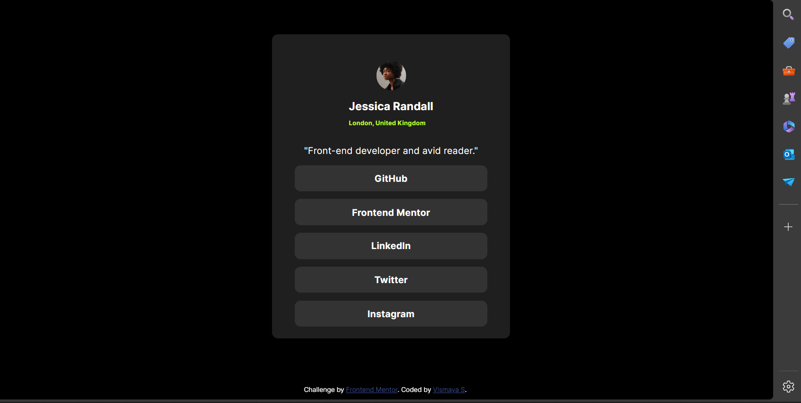

# Social Links Profile

This is a solution to the Social Links Profile challenge on Frontend Mentor. Frontend Mentor challenges help you improve your coding skills by building realistic projects.

## Table of Contents

- [Overview](#overview)
  - [The Challenge](#the-challenge)
  - [Screenshot](#screenshot)
  - [Links](#links)
- [My Process](#my-process)
  - [Built With](#built-with)
  - [What I Learned](#what-i-learned)
- [Author](#author)
- [Acknowledgments](#acknowledgments)

## Overview

### The Challenge

Users should be able to:

- View the optimal layout for the interface depending on their device's screen size
- See hover states for all interactive elements on the page

### Screenshot

### Links

- Solution URL: https://www.frontendmentor.io/solutions/responsive-social-link-profile-using-html-and-css-DiZ9P0ejB6
- Live Site URL: [Add live site URL here](https://your-live-site-url.com)

## My Process

### Built With

- Semantic HTML5 markup
- CSS custom properties
- Flexbox
- CSS Grid
- Mobile-first workflow

### What I Learned

I learned how to make a responsive layout using Flexbox and CSS Grid. Additionally, I practiced using media queries to adapt the design for different screen sizes.

## Author

- Frontend Mentor - [@VismayaSKumar](https://www.frontendmentor.io/profile/VismayaSKumar)
- GitHub - [@VismayaSKumar](https://github.com/VismayaSKumar)

## Acknowledgments

This project was inspired by the Frontend Mentor community. Special thanks to all the mentors and fellow developers who provided feedback and support.
